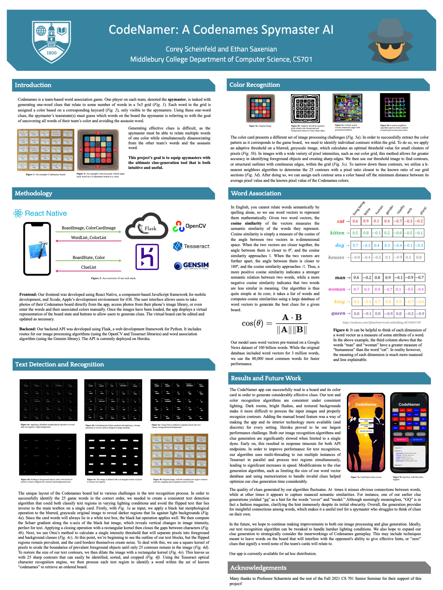

# CodeNamer: A Codenames Spymaster AI
This app is intended as a tool to help Spymasters generate clues for Codenames. Users first take a picture of the 5x5 board as well as the color keycard and can then generate clues from a virtual representation of the boardstate. There is also an option to enter a board manually which bypasses the camera functionality.

The app works by communicating with a Flask api currently deployed to Heroku (https://code-namer.herokuapp.com/) which includes the functionality for image processing and clue generation. The code for the api is located at https://github.com/ethansaxenian/CodeNamer-api.

